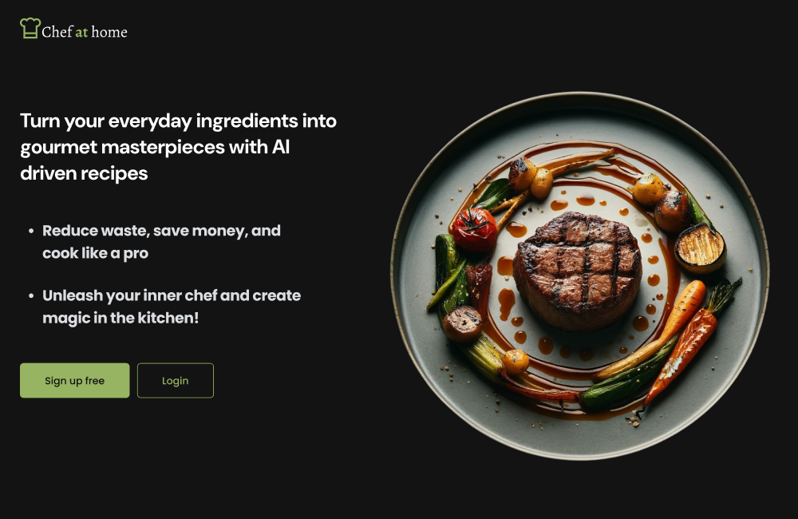
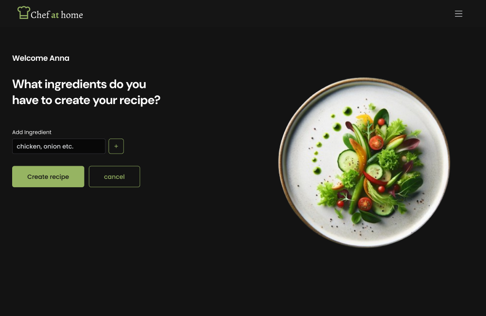
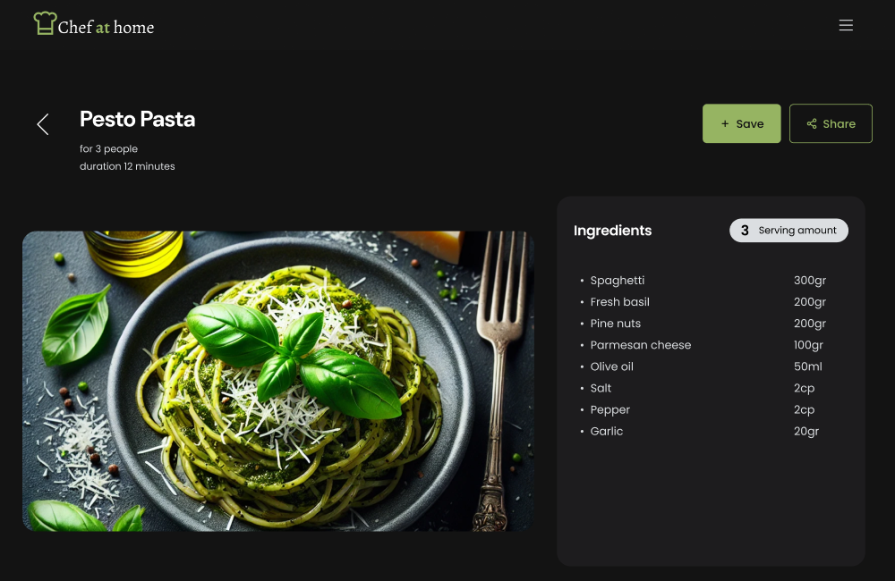
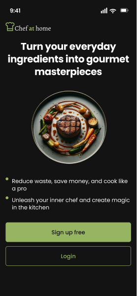
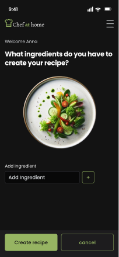
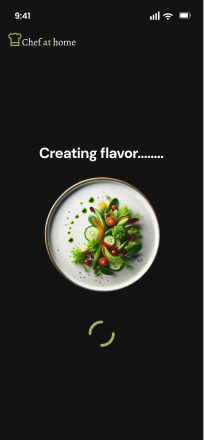
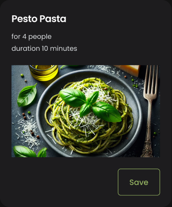
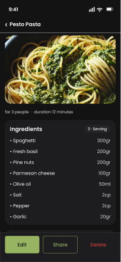
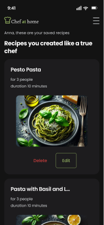

# 🍳 Chef at Home — AI Recipe Generator

Turn your everyday ingredients into gourmet recipes with AI. A modern,
fully responsive, mobile‑first web app built as a **portfolio piece** to show
end‑to‑end product work: a design system implemented in code, pixel‑matched to
Figma, with free & unlimited AI recipe generation.

<p align="center">
  <a href="https://chef-at-home-v1.vercel.app"><b>🌐 Live Demo</b></a>
  &nbsp;·&nbsp;
  <a href="https://www.figma.com/design/wOuCDVihYDlaoOUXhsTDx5/Chef-at-Home"><b>🎨 Figma Design</b></a>
</p>

---

## 📸 Screenshots

The UI is a 1:1 implementation of the Figma design system (dark‑first, fully responsive from mobile 390 → desktop 1280).

### 🖥️ Desktop

<p align="center">
  
</p>
<table>
  <tr>
    <td align="center"><br/><sub>Create a recipe</sub></td>
    <td align="center"><br/><sub>Recipe detail</sub></td>
  </tr>
</table>

### 📱 Mobile

<table>
  <tr>
    <td align="center"><br/><sub>Home</sub></td>
    <td align="center"><br/><sub>Create wizard</sub></td>
    <td align="center"><br/><sub>Generating</sub></td>
  </tr>
  <tr>
    <td align="center"><br/><sub>Recipe results</sub></td>
    <td align="center"><br/><sub>Recipe detail</sub></td>
    <td align="center"><br/><sub>My recipes</sub></td>
  </tr>
</table>

> 👉 Try the interactive app on the [**live demo**](https://chef-at-home-v1.vercel.app).

---

## 🧭 Project Context (Portfolio)

**Role:** UX/UI Designer & Frontend Developer (end‑to‑end — design + code).

**The challenge.** Chef at Home started as a functional AI recipe app with a
paid AI backend and fragmented styling. I took it from a working prototype to a
polished, production‑ready product: a real **design system** (designed in Figma
and implemented in code), a **fully responsive** experience matched 1:1 to the
mobile and desktop designs, and a **zero‑cost AI** pipeline.

**What I did.**

- **Designed a design system in Figma** — semantic color tokens (Light/Dark),
  a Poppins type scale, 4/8pt spacing, and a component library (buttons, inputs,
  cards, nav, chips, modals) — then **implemented it 1:1 in code** with Tailwind
  v4 tokens.
- **Rebuilt the UI to be 100% responsive** (mobile 390 → desktop 1280), matching
  each Figma screen: onboarding, create wizard, results, recipe detail, saved
  recipes, and the navigation/overlays.
- **Migrated the AI to free & unlimited** — swapped the paid OpenAI/DALL‑E
  pipeline for **Google Gemini 2.5 Flash** (structured JSON output) and free
  stock photography, removing per‑use cost and daily limits.
- **Modernized the stack** — Next.js 15 + React 19 + Tailwind v4 + Turbopack,
  and added full **SEO** (metadata, Open Graph, sitemap, robots, PWA manifest).

**Highlights.**

- 🌗 Design system with Light/Dark theming, tokens, and reusable components
- 📐 Pixel‑matched responsive UI (Figma → code)
- 🆓 Free, unlimited AI recipe generation (Google Gemini)
- 🟢 Lighthouse: **SEO 100 · Accessibility 100 · Best Practices 100 · Performance 91**

**Links:** [Live demo](https://chef-at-home-v1.vercel.app) ·
[Figma design](https://www.figma.com/design/wOuCDVihYDlaoOUXhsTDx5/Chef-at-Home)

---

## ✨ Features

- **🤖 AI recipe generation** — describe your ingredients and get complete,
  structured recipes (title, ingredients, steps, timing) powered by **Google
  Gemini 2.5 Flash** with JSON structured output.
- **🆓 Free & unlimited** — recipe generation runs on Gemini's free tier, with
  no daily limits and no paid image APIs.
- **📱 100% responsive** — mobile‑first (390px) scaling to desktop (1280px),
  matching the Figma designs section by section.
- **🎨 Design system in code** — semantic design tokens, Light/Dark theming,
  Poppins type scale, 4/8pt spacing, and reusable token‑driven components.
- **🔐 Authentication** — register / login with JWT‑based sessions.
- **📒 Recipe management** — save, edit, and delete your favorite recipes.
- **🔎 SEO ready** — per‑route metadata, Open Graph / Twitter cards,
  `robots.txt`, `sitemap.xml`, PWA manifest and theme‑color.

---

## 🛠️ Tech Stack

| Area | Tech |
|---|---|
| Framework | **Next.js 15** (App Router, Turbopack) · **React 19** · TypeScript |
| Styling | **Tailwind CSS v4** (CSS‑first `@theme`, semantic tokens, dark/light) |
| State | Zustand |
| AI | **Google Gemini 2.5 Flash** via `@google/genai` (structured JSON output) |
| Data | Prisma + PostgreSQL (Neon) |
| Auth | JWT‑based sessions (bcrypt) |
| Testing | Vitest (unit) · Cypress (E2E) |
| Tooling | ESLint (flat config) · Prettier |
| Deployment | Vercel |

---

## 🎨 Design System

The app implements the [Chef at Home Figma design system](https://www.figma.com/design/wOuCDVihYDlaoOUXhsTDx5/Chef-at-Home) in code:

- **Semantic tokens** (`globals.css`, Tailwind v4 `@theme`) — `bg-canvas`,
  `bg-surface`, `text-fg`, `text-muted`, `text-primary`, `border-border`, … —
  mode‑aware for **Dark (default)** and **Light**.
- **Type scale** — Poppins, Display → Button, with a wordmark in Alegreya.
- **Spacing / radius** — 4/8pt scale (`sm 8 · md 12 · lg 16 · xl 24 …`) and
  `rounded-sm/md/lg/full`.
- **Components** — token‑driven `Button` (primary/secondary/tertiary/danger/icon),
  `Input`, `Card`, `Nav`, `Badge`, `Tag`, `Chip`, `ServingSelector`, modal…
- **Breakpoints** — Mobile 390 ↔ Desktop 1280, WCAG AA contrast in both modes.

---

## 🚀 Getting Started

### Prerequisites

- Node.js **20+**
- A **Google Gemini API key** (free — [Google AI Studio](https://aistudio.google.com/apikey))
- A PostgreSQL database URL (e.g. [Neon](https://neon.tech))

### Installation

```bash
# 1. Clone
git clone https://github.com/anakarinasuarez/chef-at-home.git
cd chef-at-home

# 2. Install
npm install

# 3. Environment — create .env.local
cp .env.example .env.local   # then fill in the values below

# 4. Database
npx prisma generate

# 5. Run (Turbopack dev server)
npm run dev
```

Open [http://localhost:3000](http://localhost:3000).

### Environment variables

| Variable | Description | Required |
|---|---|---|
| `GOOGLE_GEMINI_API_KEY` | Google Gemini API key (free tier) for recipe generation | ✅ |
| `DATABASE_URL` | PostgreSQL connection string | ✅ |
| `JWT_SECRET` | Secret for signing auth tokens | ✅ |
| `OPENAI_API_KEY` | Optional fallback for recipe generation | ⬜ |

---

## 🧪 Testing & Quality

```bash
npm run type-check      # TypeScript
npm run lint            # ESLint
npm test                # Vitest (unit)
npm run cypress:run     # Cypress (E2E)
npm run quality         # type-check + lint + tests
```

## 📦 Build

```bash
npm run build
npm start
```

## 🌐 Deployment

Deployed on **Vercel** with automatic deploys from `main`. Add the environment
variables above in the Vercel dashboard.

---

## 👩‍💻 Author

**Ana Karina Suarez Gonzalez** — UX/UI Designer & Frontend Developer

- GitHub: [@anakarinasuarez](https://github.com/anakarinasuarez)
- Live demo: [chef-at-home-v1.vercel.app](https://chef-at-home-v1.vercel.app)
- Figma: [Chef at Home design](https://www.figma.com/design/wOuCDVihYDlaoOUXhsTDx5/Chef-at-Home)

---

<p align="center">⭐ Star this repo if you like it!</p>
